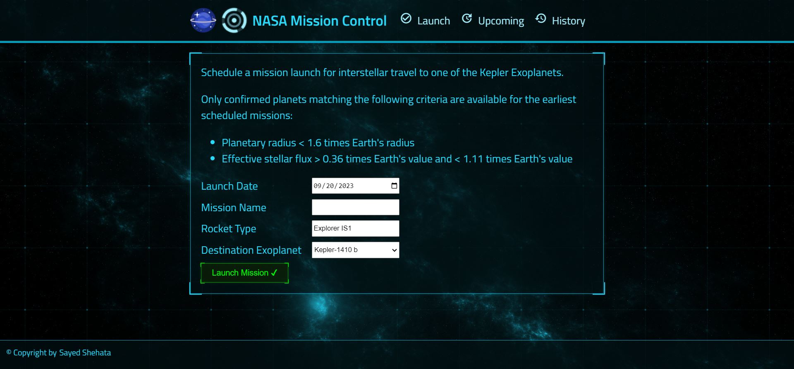

<div id="top"></div>


<div align="center">
  <a href="http://3.86.163.177:8000/">
    
  </a>
  <h1>NASA-Mission-Control</h1>
  <p align="center">
  <a href="http://35.171.27.114:8000/">View Demo</a>
    ·
    <a href="https://github.com/SayedShehata1/NASA-Mission-Control/issues">Report Bug</a>
  </p>
  
</div>

<details>
  <summary>Table of Contents</summary>
  <ol>
    <li>
      <a href="#about-the-project">About The Project</a>
      <ul>
        <li><a href="#built-with">Built With</a></li>
        <li><a href="#architecture">Architecture Diagram</a></li>
      </ul>
    </li>
    <li>
      <a href="#getting-started">Getting Started</a>
      <ul>
        <li><a href="#installation">Installation</a></li>
        <li><a href="#ports--endpoints">Ports & EndPoints</a></li>
      </ul>
    </li>
    <li><a href="#contributing">Contributing</a></li>
    <li><a href="#issues">Issues</a></li>
    <li><a href="#acknowledgments">Acknowledgments</a></li>
  </ol>
</details>

## About The Project

NASA dashboard app for managing and monitoring spaceflights to habitable planets in the observable universe.


## Built with

- Javascript
- React
- Node.js
- Express
- MongoDB
- Jest
- Docker
- AWS

## Architecture Diagram


<p align="right">(<a href="#top">back to top</a>)</p>

---

## Getting Started

This project require some prequesites and dependenscies to be installed, you can find the instructions below :

> To get a local copy, follow these simple steps :

### Installation

#### installing Locally

1. Clone the repo
   ```sh
   git clone https://github.com/SayedShehata1/NASA-Mission-Control.git
   ```
2. go to project folder

   ```sh
   cd NASA-Mission-Control
   ```

3. install dependenscies

   ```bash
   npm run install
   ```

4. Enviromental Variables Set up

   - Here are the environmental variables that needs to be set in a .env file. This is the default setting that I used for development, but you can change it to what works for you.

   ```
     PORT = 8000
     MONGO_URL = <Your mongoDB url>
   ```

5. Change API_URL to `"http://localhost:8000/v1"` in "./client/src/hooks/requests.js"

6. Create a build directory

   ```sh
   npm run deploy
   ```

7. Run development server

   ```sh
   npm run server
   ```

<p align="right">(<a href="#top">back to top</a>)</p>

---

### Ports & EndPoints

#### Ports

- FrontEnd Server runs on port `3000`
- Backend Server runs on port `8000`

#### API endpoints

- Planets

  - Index: [http://localhost:8000/v1/planets](http://localhost:8000/v1/planets) [get]

- Launches

  - Index: [http://localhost:8000/v1/launches](http://localhost:8000/v1/launches) [get]
  - Create: [http://localhost:8000/v1/launches](http://localhost:8000/v1/launches) [post]
  - Delete: [http://localhost:8000/v1/launches/:id](http://localhost:8000/v1/launches/:id) [delete]

[](https://app.getpostman.com/run-collection/f814f3d64372b7b6fede?action=collection%2Fimport)

---

## Contributing

Contributions are what make the open source community such an amazing place to learn, inspire, and create. Any contributions you make are **greatly appreciated**.

If you have a suggestion that would make this better, please fork the repo and create a pull request. You can also simply open an issue with the tag "enhancement".
Don't forget to give the project a star! Thanks!

1. Fork the Project
2. Create your Feature Branch (`git checkout -b feature/AmazingFeature`)
3. Commit your Changes (`git commit -m 'Add some AmazingFeature'`)
4. Push to the Branch (`git push origin feature/AmazingFeature`)
5. Open a Pull Request

<p align="right">(<a href="#top">back to top</a>)</p>

## Issues

If you have error message "error:0308010C:digital envelope routines::unsupported" while running the server

> On Unix-like (Linux, macOS, Git bash, etc.):

```bash
  export NODE_OPTIONS=--openssl-legacy-provider
```

> On Windows command prompt:

```bash
  set NODE_OPTIONS=--openssl-legacy-provider
```

## Acknowledgments

- [odziem](https://github.com/odziem)
